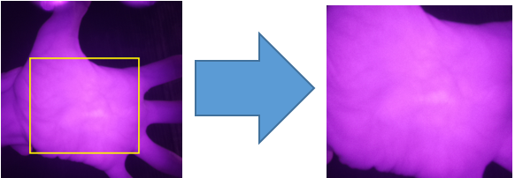
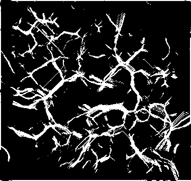
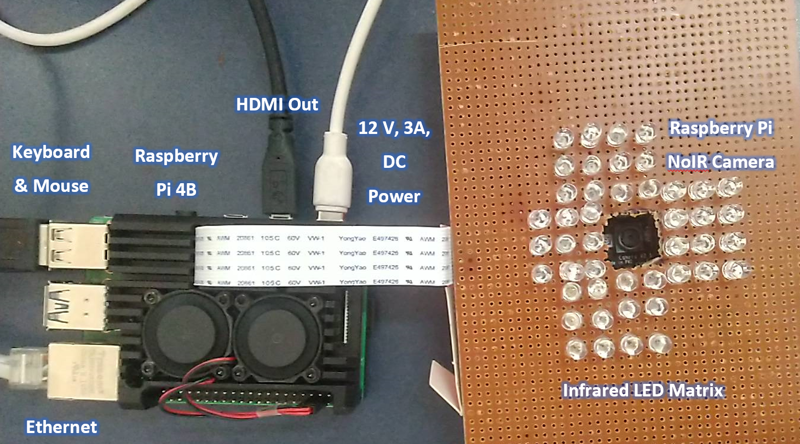
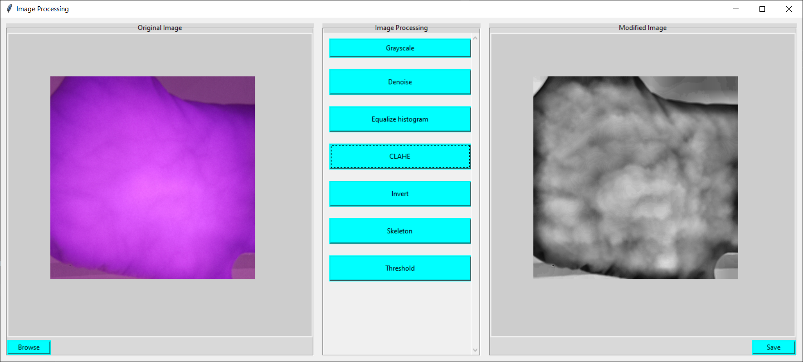
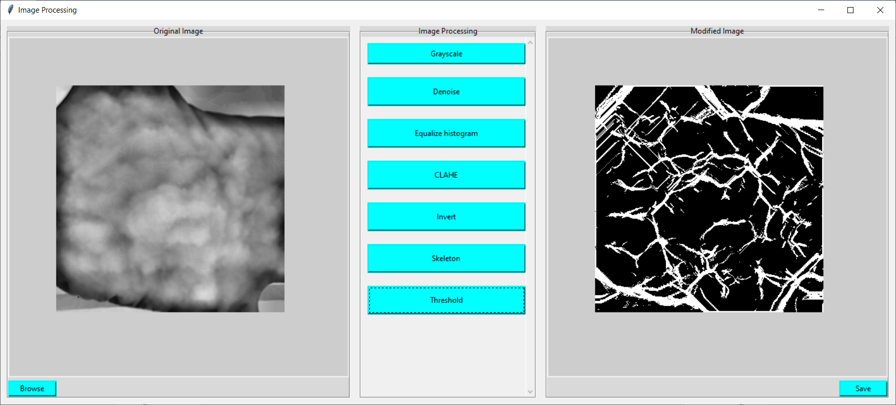
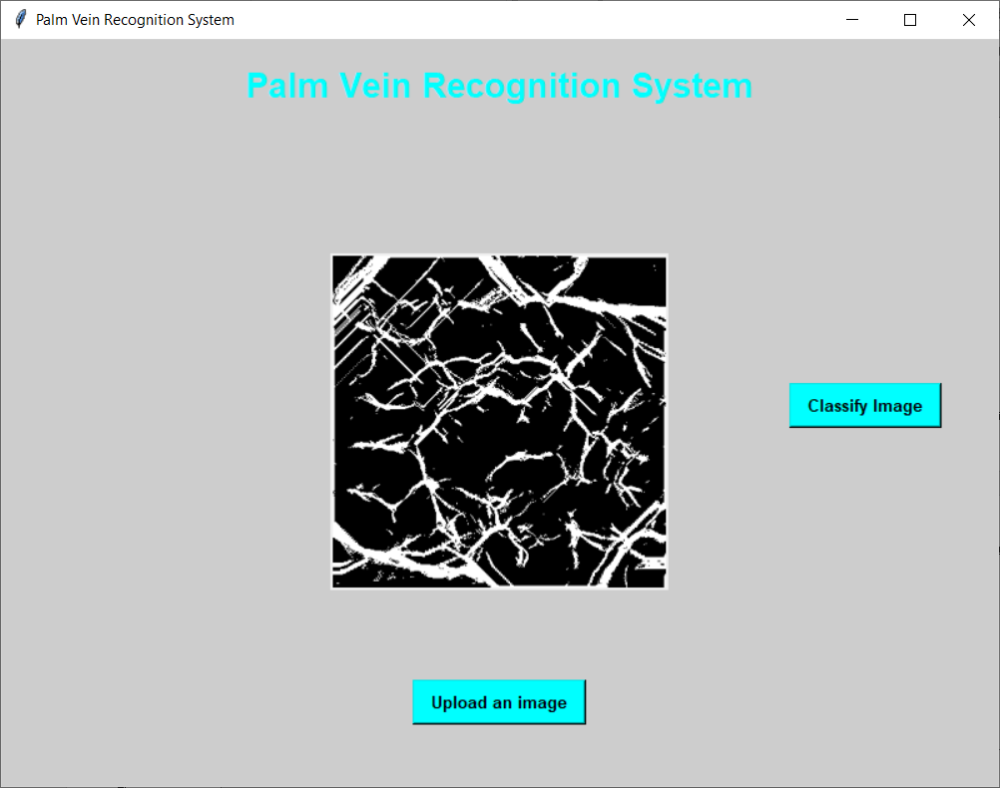
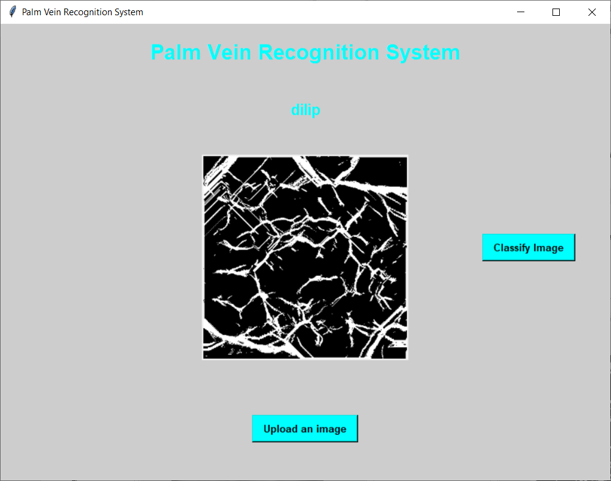

# Palm Vein Recognition System.

## What is this Project?
While it might not be prehistoric, biometrics have been around for a long time. But as technological advancement has taken place in the last century, biometrics have also been rapidly developed. Since the COVID-19 epidemic, biometrics have grown in prominence, and contactless biometrics are now being pushed even more. Biometrics have gone from rough methods of classification to being authenticators of identity having a wide range of uses. Among these biometrics, palm/dorsal vein authentication has taken a significant attention because of its uniqueness, stability, non-intrusiveness and also for it being contactless biometric.

## How does it Work?
Near-infrared rays and the way haemoglobin in the veins respond to these rays are used in palm vein scanning devices, including those for finger vein ID. Oxygenation of haemoglobin in the lungs leads to delivery of oxygen-rich blood to tissues all throughout the body via arteries. The veins return the deoxygenated blood to the heart through the lungs and other organs. 

## System and Circuit Diagram
The capture of infrared light can be accomplished by most low cost cameras. The camera sensors are generally capable of capturing the near-field band. Some cameras even use the technology for such things as auto focus. In more high end cameras, the infrared light is blocked out using filters.

The deoxidized haemoglobin travelling through the veins is absorbed by the near-infrared light from a palm scanner. When haemoglobin is deoxygenated, it absorbs more light, limiting the capacity of the veins to reflect it back. This results in a black pattern on the veins, which the camera on the device may record as a picture. After then, the image's raw data is processed and compared to a previously recorded record on the subject.

